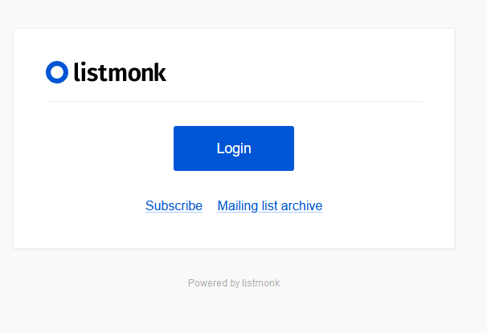

# Listmonk CI/CD pipeline

Deploy Listmonk with CI/CD on Elestio

 
 

# Once deployed ...

You can open Listmonk UI here:

    URL: https://[CI_CD_DOMAIN]:9090
    email: [ADMIN_EMAIL]
    password: [ADMIN_PASSWORD]

